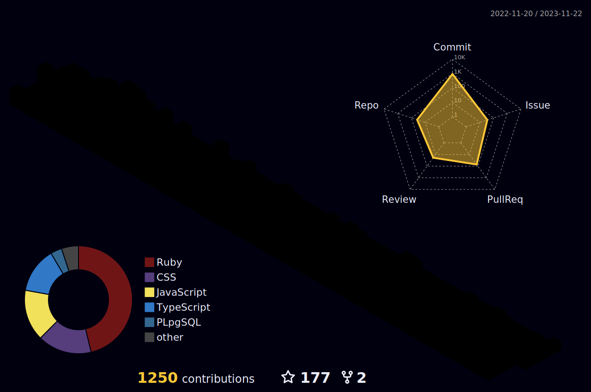

<h1>Hey, I'm Cesar,  I'm A Full stack developer 👋 </h1>

<table border="0">
  <tr border="0">
    <td valign="top"  border="0" width="50%">
    Here are some ideas to get you started:

- 🌱 I’m currently learning **C++, C#, Zig**
- 👨‍💻 All of my projects are available at [Portfolio](https://cvalencia1991.github.io/Portfolio/)
- 💬 Ask me about: **Vue and Ruby on Rails**
- 📫 How to reach me: **cesar4a6z@gmail.com**
- ⚡ Fun fact: **Play Games**
     </td>
    <td valign="top">
       

         
        

     </td>
  </tr>
</table>

<table width="100%" align="center">
   <tr>
      <td>
         
      </td>
      <td>
         
      </td>
   </tr>
</table>

   <h3 align="left">Languages:</h3>
   

      
   

   <h3 align="left">Frameworks:</h3>
   

      
   

     <h3 align="left">Databases:</h3>
     

      
   

   <h3 align="left">Libraries:</h3>
   

      
   

   <h3 align="left">Enviorments:</h3>
     

      
   

   <h3 align="left">DevOps:</h3>
        

      
   

   

      
   

   <h3 align="left">Contact With Me:</h3>
   
   

